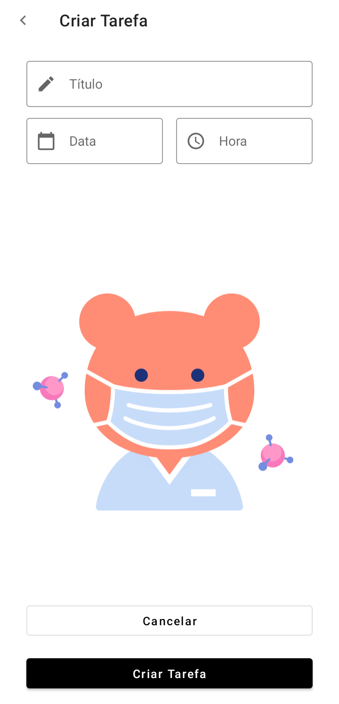
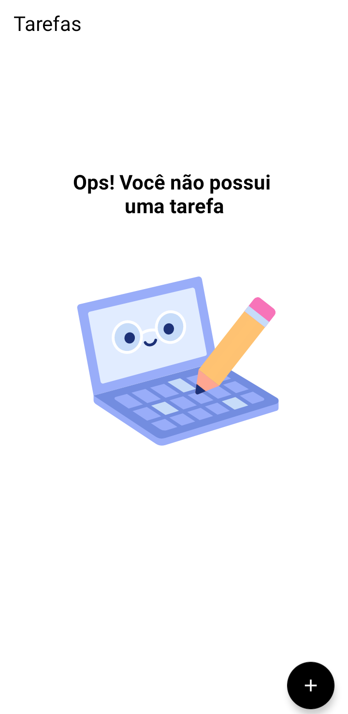

# AntiCovidList-AppKotlin-BootcampSantanderDio

O aplicativo é uma lista de lembretes, o objetivo é ajudar a recordar tarefas frequentes como comprar mascaras, álcool em gel, a data da próxima dose da vacina e outros.

Proximos passos após o projeto inicial:
- Salvar os dados com o Room Database após o aplicativo ser fechado
- Adicionar um campo de lembretes frequentes
- Fazer algumas alterações no layout das datas
- Enviar notificação com a proximidade das datas salvas

Tela de adição de tarefa

Tela Inicial

